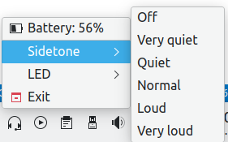

# kakophony
The kakophony (from [cacophony](https://dictionary.cambridge.org/dictionary/english/cacophony)) is a simple front-end for the [headsetcontrol](https://github.com/Sapd/HeadsetControl/) command line utility.

## Supported features
- battery percentage display
- sidetone level control
- LEDs control

## Credits
The utility was inspired by a similar script [headset-charge-indicator](https://github.com/centic9/headset-charge-indicator) for GNOME.

Fallback app icon by [Hilmy Abiyyu Asad](https://freeicons.io/profile/75801)

## License
© Ondrej Golasowski. The utility is available as open source under the terms of the MIT License.